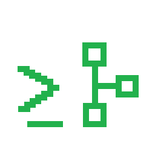

# GitSage


Local AI powered commit generator based on ur repository local change.

## Installation

### Prerequirements

    - Python>=3.10
    - Python3-pip or Python3-pipx
    - Python3-venv (optional if using pipx)
    - Ollama

#### Start Ollama

```bash
$> ollama pull qwen3:8b (or the model of your choice)
```

#### Create your virtual environnent (if using pip)

```bash
$> python3 -m venv .venv
```

##### Use your virtual environnement

```bash
$> source .venv/bin/activate
```

### Install GitSage

#### with pip :

```bash
(.venv) $> pip install gitsage
```

#### with pipx :

```bash
$> pipx install gitsage
```

## Usage

```bash
$> gitsage <command> <options>
```

### Commands

    help              Show this help message
    commit            Generate a commit message based on the staged changes

### Options

    --copy            Copy the output to the clipboard

## Configuration

The default configuration file is located at `~/.config/gitsage/config.toml`. If the file does not exist, it will be created with default values when you run the tool for the first time.

### Default Configuration :

```toml
model = "qwen3:8b"
prompt = """You generate Git commit messages.

Analyze the following staged git diff.

Return ONLY a single Conventional Commit message.
Format:
type(scope): description

Rules:
- Use feat, fix, refactor, docs, test, chore, or perf
- Keep the description concise
- Use imperative mood
- Do not invent changes
- Do not include markdown

"""
ollama_url = "http://localhost:11434"
```

You can modify the `model`, `prompt`, and `ollama_url` values in the configuration file to customize the behavior of GitSage according to your needs.

## Contributing

If you would like to contribute to GitSage, please follow these steps:

1. Fork the repository on GitHub.
2. Clone your fork to your local machine.
3. Create a new branch for your changes.
4. Make your changes and commit them with clear messages.
5. Push your changes to your fork on GitHub.
6. Open a pull request to the main repository.

